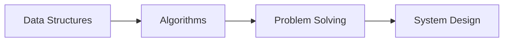

  

---

### 🛠️ **Tech Stack**

#### **Languages & Frameworks**

#### **Tools & Platforms**

---

### 📚 **Currently Learning**

---

### 📊 **GitHub Stats**

  
  

---

### 🌐 **Let's Connect!**

---

### 💡 **Coding Philosophy**
> *"Learning to code is learning to create and innovate - one algorithm at a time."*  
> *"The best error message is the one that never shows up."*

---

  

